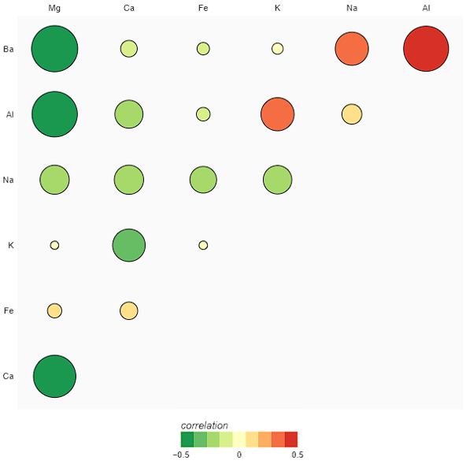

# Correlogram

- Alternative names: correlation matrix, correlation graph
- Aesthetics used: colors, position, numbers
- Potential pitfalls: 
Too many variables can make the correlogram cluttered and difficult to interpret.
Assuming that correlation implies causation.

- [Example](./correlogram.ipynb)

## Multiple choice questions

"What is a common pitfall when interpreting correlograms?"

- A) Assuming correlation implies causation.
- B) Ignoring the aesthetic representation.
- C) Considering it only suitable for small datasets.
- D) Using only for categorical data.

Correct answer: A)
